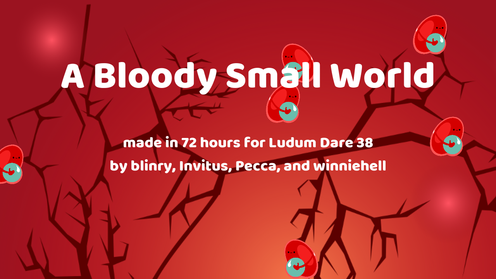
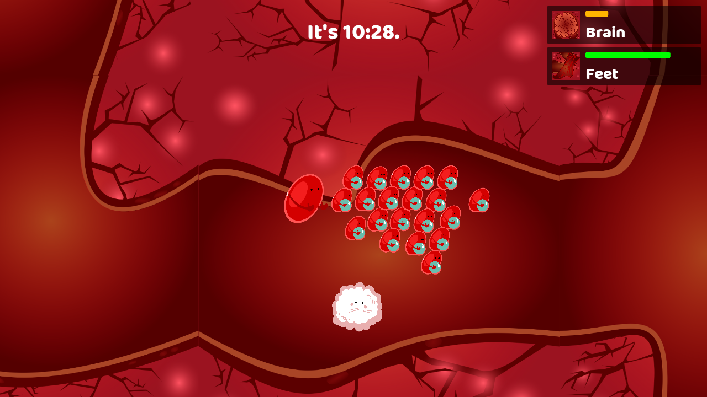

# A Bloody Small World

Made in 72 hours for *Ludum Dare 38* by blinry, Invitus, Pecca, and winniehell.

### License

- Code: [GPLv3+](https://www.gnu.org/licenses/gpl.html)
- Graphics, sound, and music: [CC BY-SA 4.0](https://creativecommons.org/licenses/by-sa/4.0/)

The font is [Baloo](https://github.com/EkType/Baloo) by Ek Type, licensed under the [SIL Open Font License v1.1](http://scripts.sil.org/OFL).

### Screenshots

